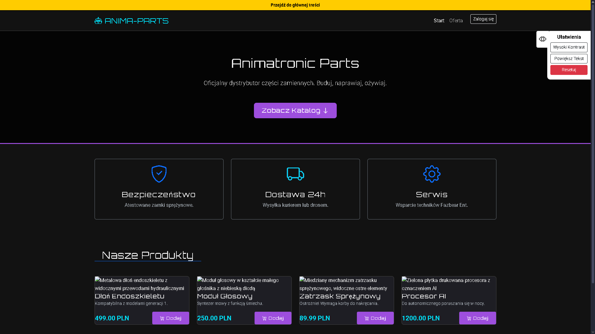

## 21215-Aplikacje "MeScrap"

> Ten podprojekt jest częścią materiałów z laboratorium z przedmiotu: **Aplikacje internetowe I**.
---
### Plan:
**Tematyka:**
Sklep z częściami animatronicznymi
---
**Logo:**

**Pomysł na bazę:** 
```
1.users
2.password_reset_tokens
3.failed_jobs
4.personal_acces_tokens
5.roles
6.categories
7.manufacturers
8.products
9.product_specification
10.reviews
11.discounts
12.shipping_methods
13.order_statuses
14.orders
15.order_items
```
---
### Pierwszy Prototyp Strony głównej:

**Opis:**
Stan z 09-12-2025

### Autor
* Jakub "Benito" Błażko
    * Email: 21215@student.ans-elblag.pl